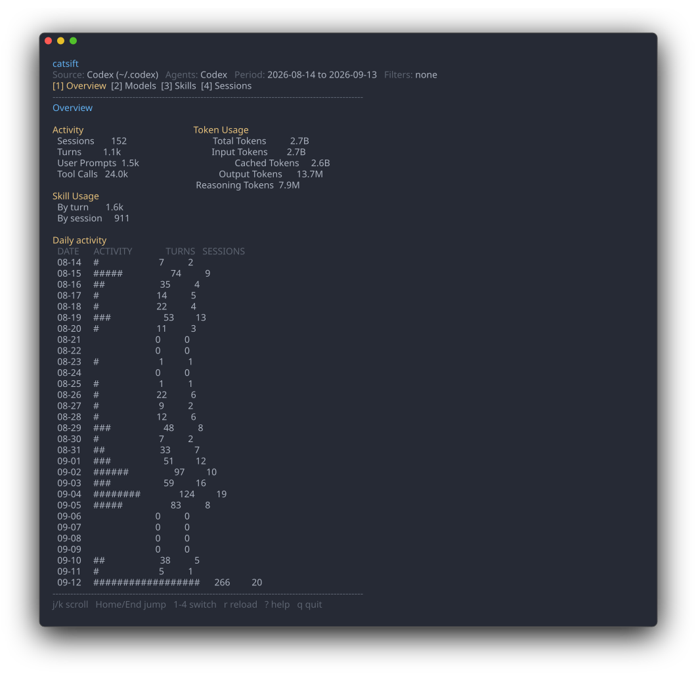

# CatSift: Sift through Coding Agent Traces

CatSift analyzes local coding-agent history and presents usage data by source,
model, skill, and session.

[日本語版](README.ja.md)

> [!NOTE]
> CatSift reads:
> - Codex local history
> - GitHub Copilot CLI local history
> - OpenCode local history
> - [ctx](https://github.com/ctxrs/ctx) event stream (experimental)

## Quick start

Try CatSift without installing it first:

```sh
npx catsift
```



## Installation

Install with npm:

```sh
npm install --global catsift
```

Or download from [GitHub Releases](https://github.com/xkumiyu/catsift/releases).

Or install from source:

```sh
go install github.com/xkumiyu/catsift/cmd/catsift@latest
```

## Usage

Launch interactive mode:

```sh
catsift
```

Explore local agent usage with the following views:

| View | Shows |
| --- | --- |
| Overview | Usage totals, recent activity, recent sessions, and top skills/models |
| Activity | Daily or monthly activity |
| Models | Token usage by provider and model, with related sessions |
| Skills | [Skill usage](#skill-usage-fields), evidence state, and related sessions |
| Sessions | Session metadata and chronological turn details |

Filter usage by period or keywords and sort lists. Press `?` inside the TUI for details.

## Common options

These options apply to both [interactive mode](#usage) and [CLI mode](#cli-usage):

- `--source` selects one or more history sources: `codex`, `copilot`, `opencode`, or
  `ctx`. Separate sources with commas or repeat the option. If omitted,
  CatSift automatically reads available agent-specific histories. The `ctx`
  event stream is not auto-detected; select it explicitly.
- `--strict-input` exits non-zero when input records are skipped.

## Skill usage fields

Skill usage is categorized by activation mode and evidence state.

| Dimension | Field | Meaning |
| --- | --- | --- |
| Activation mode | `Explicit` | An explicit skill request or invocation was observed, such as `$skill-name` or a structured Skill call. |
| Activation mode | `Implicit` | Usage inferred from runtime access to a skill's `SKILL.md` or scripts without an explicit request. |
| Activation mode | `Unknown` | Skill evidence was found, but the history does not reveal whether activation was explicit or implicit. |
| Evidence state | `Confirmed` | The history contains direct evidence that the skill instructions or a skill item/tool was loaded or invoked. |
| Evidence state | `Inferred` | Usage inferred from runtime file or script access. |
| Evidence state | `Unconfirmed` | An explicit request was observed, but no confirming evidence was found. |

Activation mode and evidence state are independent. A single usage can have
evidence for more than one activation mode, so the mode counts do not always
add up to `Total`.

## CLI usage

Run a subcommand to execute CatSift in CLI mode.

| Command | Description |
| --- | --- |
| `catsift stats` | Show an overview of agent usage |
| `catsift activity` | Show daily activity |
| `catsift models` | Show model usage and details |
| `catsift tools` | Show tool usage by canonical name |
| `catsift skills` | Show skill usage and evidence state |
| `catsift sessions` | Show session usage and details |

Use a command's `detail` subcommand to view one model, skill, or session.

Use `--json` to emit machine-readable output.

See each command's `--help` output for details.

### Usage overview

```sh
catsift stats
```

```text
USAGE OVERVIEW
Source: Codex (~/.codex), OpenCode (~/.local/share/opencode)
Agents: Codex, OpenCode
Period: 2026-01-01 to 2026-01-31

Activity
  Sessions                    123
  Turns                       456
  User Prompts                789
  Tool Calls                   42

Skill Usage
  By turn                       9
  By session                    6

Token Usage
  Total Tokens                3.16B
    Input Tokens              3.14B
      Cached Tokens           3.06B
    Output Tokens             13.3M
      Reasoning Tokens        6.40M
```

`Period` shows the date range of data included in the aggregation.

For ctx sources, token usage is not available.

### Skill usage

```sh
catsift skills --view mode
```

```text
SKILL USAGE
Source: Codex (~/.codex), OpenCode (~/.local/share/opencode)
Agents: Codex, OpenCode
Period: 2026-01-01 to 2026-01-31
Group by: turn
Strict: false
View: mode

Skill                       Explicit  Implicit  Unknown  Total
──────────────────────────────────────────────────────────────
code-review                       5         1        0      6
openspec-apply-change             2         1        0      3

2 skills, 9 uses total
```

### Skill command options

#### Skill usage view

Choose the Skill usage view with `--view`:

```sh
catsift skills --view compact  # Total only
catsift skills --view mode     # Activation mode
catsift skills --view state    # Evidence state
catsift skills --view all      # Both tables
```

The default `--view auto` selects `compact`, `mode`, or `all` from the terminal width.

Use `--group-by` to group usage by turn or session, and `--strict` to include
only `Confirmed` usage.

Use `skills detail NAME` to show one Skill's deduplicated detail and related sessions:

```sh
catsift skills detail review
```

#### Unused skills

Use `--unused` with `skills` to compare the selected history source with the
installed skill inventory:

```sh
catsift skills --unused
```

Inventory identity is the canonical skill name plus its absolute physical path.
Therefore, same-name skills at different paths are shown as separate rows when
the name is unused.
Usage matching remains canonical-name based: if any agent in the selected history sources used a name, all inventory rows with that name are considered used.

## Cache

Parsed results are cached in the OS-standard user cache directory to speed up
subsequent runs.

## Data handling

CatSift reads selected history from Codex, GitHub Copilot CLI, OpenCode, or ctx.
All inputs are read-only and local-only; CatSift never sends them externally.
`skills --unused` also reads the installed skill inventory. The TUI and reports
exclude prompt text, command text, Tool arguments, Skill bodies, provider
payloads, and other raw event details.
